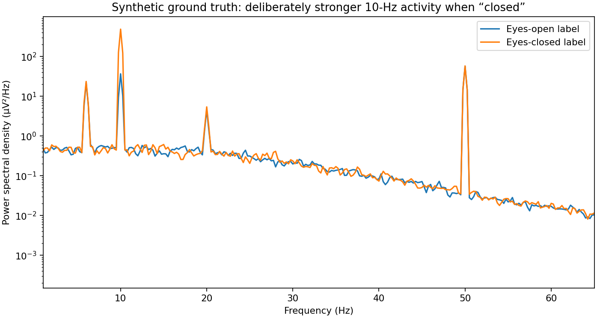

# Results report: ADS1299 Learning Lab

**Release check: 19 September 2026.** This report distinguishes software execution, numerical modeling, external simulator execution, target compilation and physical validation. They are not interchangeable.

## Outcome

A runnable, hardware-free ADS1299-oriented learning project was created and exercised. It includes source code, regression tests, synthetic recordings, circuit-model outputs, a real localhost transport exercise, an offline visual guide and a conditional hardware progression.

**Final regression result: 65 passed, 0 failed, 0 errors, 0 skipped.** This result covers the included tests. It does **not** count unavailable ngspice execution or ESP32 target compilation as successful tests; those checks have separate explicit statuses.

No physical ADS1299/ESP32 board was connected, no human EEG was recorded, and no body-connected circuit was approved. The exact hardware and a complete under-$100 purchasing solution remain unresolved.

## Verification matrix

| Area | Actual result | Evidence and boundary |
|---|---|---|
| Python regression suite | **65 passed** | `../results/validation/pytest.log` and `pytest.xml`; covers the layers below. |
| Python syntax compilation | Completed | `python -m compileall -q lab tools tests run_lab.py`. |
| Ideal ADC scaling and limits | Tested | Signed-code endpoints, quantization, range and common-mode checks; not measured chip accuracy. |
| Passive input-circuit solver | Executed | Independent nodal calculation, limiting-case tests and 200 tolerance trials. |
| Actual ngspice | **Not run** | Binary unavailable; installation attempts unsuccessful. Strict command exited nonzero rather than claiming a pass. |
| Synthetic analysis | Executed | Default and null-control raw datasets, reports, quality CSVs and example figures. |
| Real localhost UDP | Executed | 2,248 received packets; both deliberate missing samples detected; no physical radio involved. |
| Portable firmware helpers | Native C++ compiled/tested | CRC, signed 24-bit conversion and packet output matched Python byte-for-byte. |
| Complete ESP32 sketch | **Not target-compiled or hardware-tested** | ESP32 toolchain unavailable. Portable C++ success does not validate the whole firmware. |
| Visual-guide arithmetic | Executed under Node | Valid/invalid gain-offset-common-mode examples tested. |
| Visual-guide browser rendering | **Not run** | Playwright installed, Chromium executable unavailable. HTML is not described as browser-render-verified. |
| Physical power/protection/bias | **Not tested** | No board identified or present. |
| Physiological EEG / meditation | **Not measured** | All provided recordings are explicitly synthetic. |

The authoritative machine-readable record is [VALIDATION.json](../VALIDATION.json). See [CHANGELOG.md](../CHANGELOG.md) for the initial 55-test run, the expanded check/fix and subsequent runs.

## Default synthetic experiment

Configuration: seed 42; four channels; 250 samples/s/channel; six sessions; eight 12-second blocks/session; gain 24; nominal 4.5-V code reference; 30-mV illustrative differential offset. The generator creates 576 seconds total (144,000 simultaneous sample rows), not six independent people. It deliberately makes 10-Hz amplitude larger for the “eyes-closed” label.

| Measurement | Observed output |
|---|---:|
| Candidate four-second epochs | 96 |
| Accepted epochs | 78 |
| Rejected epochs | 18 |
| Median alpha power, open label | 12.2097 µV² |
| Median alpha power, closed label | 136.0573 µV² |
| Ratio of those medians | **11.1434** |
| Session-held-out balanced accuracy | **100%** |
| Majority-class baseline balanced accuracy | 50% |
| Mean of 20 whole-block label permutations | 52.0199% |

The accepted set contains 42 open-label and 36 closed-label epochs. Every test fold is a completely held-out synthetic session. A standardization/model pipeline is fitted only on the remaining sessions. Conditions, time and session IDs are not classifier features.

The 100% result is expected for an easy **planted** effect. It establishes neither real EEG accuracy nor consciousness decoding. The 20-permutation p-value is 1/21 in this run: too coarse to present as a serious scientific significance result.

Evidence: [analysis JSON](../results/demo/analysis_report.json), [epoch-quality CSV](../results/demo/epoch_quality.csv), [event CSV](../results/demo/events.csv), [raw synthetic NPZ](../results/demo/synthetic_recording.npz).



## Negative control: remove the condition effect

The same generator was rerun with `null_effect = true`. The labels no longer control alpha amplitude.

| Measurement | No-effect result |
|---|---:|
| Accepted / rejected epochs | 78 / 18 |
| Closed/open alpha-power ratio | **1.0268** |
| Session-held-out balanced accuracy | **54.1667%** |
| Baseline balanced accuracy | 50% |
| Mean of 20 block-label permutations | 49.9517% |

This is a useful negative control: the software does not produce perfect label recovery when the intended effect is absent. One finite near-chance result does not prove the absence of every possible leakage route. Raw data and the complete report are retained in [results/null_control](../results/null_control/analysis_report.json).

## Numerical circuit exercise

The illustrative two-input passive network passed analytical limiting-case/symmetry checks and was evaluated across frequency. This is **our own frequency-domain nodal solve**, not ngspice and not an ADS1299 silicon model.

Observed numerical outputs:

| Quantity | Model result |
|---|---:|
| Balanced differential gain at 10 Hz | 0.9998940 V/V |
| Common-to-differential conversion at 50 Hz with one contact changed from 10 kΩ to 50 kΩ | 0.00063843 V/V |
| Differential amplitude for 100-mV common-mode amplitude in that mismatched example | **63.8431 µV** |
| Independent tolerance trials | 200 |
| 10-Hz differential-gain range across those trials | 0.9998859–0.9999002 V/V |

Resistors were varied independently over ±1% and capacitors over ±5%, with uniform distributions. These are chosen uncertainty assumptions, not measured production yield. Perfectly balanced common-mode conversion is approximately numerical zero due to symmetry; it is not evidence of infinite real-system CMRR.

No body-bias loop, thermal noise, protection device, PCB parasitic or supply fault was simulated. These component values must not be interpreted as approved patient-protection values. The synthetic recording pipeline does not automatically include this network; the exercises are explicitly separate.

Evidence: [circuit report](../results/circuits/circuit_report.json), [response CSV](../results/circuits/circuit_response.csv), [tolerance CSV](../results/circuits/tolerance_trials.csv), and generated `balanced.cir` / `mismatch.cir`.

The strict external command was attempted:

```text
python run_lab.py circuits --out results/strict_spice_attempt --require-ngspice
exit code: 2
reason: native SPICE required but ngspice unavailable
```

Log: [strict_spice_attempt.log](../results/strict_spice_attempt.log). When ngspice becomes available, rerun that command and inspect its numerical comparison rather than updating this report by assumption.

## Actual localhost recording test

`python tools/run_loopback.py` started a real UDP receiver and transmitted a nine-second synthetic sample schedule at a nominal 250 SPS. Sample sequences 1000 and 2000 were deliberately not sent.

| Quantity | Observed result |
|---|---:|
| Scheduled sample positions | 2,250 |
| Valid received packets | **2,248** |
| Detected missing samples | **2** |
| Duplicates / stale packets / timing anomalies | 0 / 0 / 0 |
| Uninterrupted four-second PSD windows | 1 |
| Spectral peak in every channel | **10 Hz** |

The receiver, binary storage, decoder, gap handling and spectrum calculation all ran. The payload and device timestamps were generated in software. This does not establish ESP32 Wi-Fi throughput, actual clock accuracy or SPI acquisition reliability.

Evidence: [LOOPBACK_REPORT.json](../results/loopback/LOOPBACK_REPORT.json), binary capture, decoded CSV, metadata and quality report in `results/loopback`.

## What the tests check

The test suite includes signed 24-bit extremes; quantization and voltage units; nominal filter response; input/common-mode limits; passive-circuit symmetry and analytical limits; CRC corruption and stream resynchronization; sequence/timestamp rollover; gaps, duplicates and order; configuration consistency; deterministic generation; known-sine power; artifact/overrange rejection; held-out sessions; six/eight-channel and 500-SPS cases; null-effect behavior; gap-safe inspection; native C++/Python agreement; CLI behavior; the bench-only default gate; and the visual calculator's arithmetic.

These checks establish that the included components behave as tested. They are not an exhaustive proof of every input, dependency version or platform. The clean installation, full ESP32 build, external simulator and physical board stages still need their own evidence.

## What is delivered, and what is not

Delivered: reusable software, generated evidence, ordinary SPICE exports, a conditional bench starter, a visual explanation and a documented route to hardware.

Not delivered: manufacturing-ready Gerbers, a reviewed complete board schematic, guaranteed under-$100 assembled hardware, target-compiled firmware, external-electrode acquisition firmware, a fault-current assessment, an approved wearable instrument or real brain measurements.

The practical next step is to identify the exact ADS1299 board and ESP32 model while working through the hardware-free exercises. The hardware guide explains why the power and electrode connections cannot yet be made into a truthful universal plug-by-plug picture.
