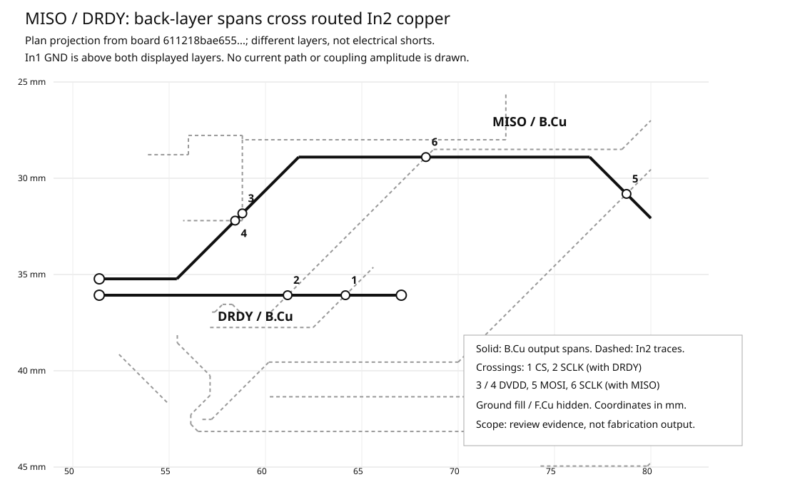

# Digital reference and return-path geometry review

Source: merged PR #62, commit `5ece3051f685c9fc70dee804d83061d5e59b2f48`,
tree `81640a52e512cf54caa9e581ab78a3260f3b07c7`. Authored board:
`hardware/rev_a/layout/rev_a.kicad_pcb`, SHA256
`611218bae6559fb2488309fc80eee20ce2d6b5855977d52d600f947099179b43`.
The board was fetched from GitHub, not recovered from an earlier chat ZIP.
No copper or circuit change is made by this review.

## Decision and next bounded slice

**Rework the long MISO/DRDY output spans to put In1 ground between them and
routed In2 signals.** Compare a front-layer main corridor with the current back
routes, retaining only necessary short escapes. This is a review recommendation
based on an avoidable unshielded routing arrangement, not a demonstrated noise
or timing failure. Do not accept a reroute that transfers the problem into the
input/BIAS section, disturbs the AVDD1 repair, or makes new merged escape slots.
No blanket requirement to add a ground via at every signal via is justified.

The scoped geometry inventory is complete; whole-board electrical performance
and stackup qualification are not. Input P/N geometry/coupling follows the
output-route repair. Component, mechanical and real-interface decisions remain
under #45/#48. No fabrication, purchasing, power-up or body-use approval.

## What the actual board contains

The copper order is **F.Cu / In1.Cu / In2.Cu / B.Cu**. The only filled reference
plane is GND on In1. In2 carries routed signals and supplies, not a continuous
power/ground plane. Both raw source and native KiCad report **no explicit
stackup**. The `general` thickness of 1.6 mm is not a dielectric-spacing,
permittivity, copper-weight or manufacturing specification.

Nine inter-board digital/control nets contain **134 segments and 15 vias**.
All their traces are 0.15 mm; vias are 0.60/0.30 mm through-holes. The table
sums **all branches of each net** by layer, not just a selected connector-to-ADC
route. For example CLKSEL includes its long pulldown branch. Reserved CLK and
GPIO1-4 pulldown nets are inspected separately, not added to these nine nets.

| Net | F.Cu mm | In2.Cu mm | B.Cu mm | Signal vias |
|---|---:|---:|---:|---:|
| SCLK | 6.437 | 25.840 | 0 | 3 |
| MOSI | 4.327 | 28.659 | 0 | 1 |
| MISO | 5.180 | 0 | **32.565** | 1 |
| CS | 18.338 | 9.769 | 0 | 2 |
| DRDY | 20.824 | 0 | **15.675** | 2 |
| RESET | 10.110 | 20.458 | 0 | 1 |
| START | 3.594 | 30.156 | 0 | 2 |
| PWDN | 25.016 | 9.373 | 0 | 3 |
| CLKSEL | 57.748 | 0 | 0 | 0 |

The [geometry record](checkpoints/20260930_digital_return_geometry.json) retains
all 15 via UUIDs, coordinates and connected trace layers, as well as the actual
J1/U1 endpoint identities. All vias physically span F-B; **12 connect F/In2
trace segments and three connect F/B segments**. START's second via is on its
pulldown spur, not the selected J1-U1 itinerary. Through-hole header pads also
span layers and must not be silently counted as signal vias.

## Finding 1: the back-layer output corridor has intervening routed copper

MISO has 32.565 mm on B; DRDY has 15.675 mm. Looking toward the only reference
plane from B encounters routed In2 first. The six centreline crossings below
are actual geometric overlaps on **different layers, not shorts**:

| B.Cu output | In2 trace | x, y (mm) |
|---|---|---|
| MISO | SCLK | 68.325, 28.900 |
| MISO | MOSI | 78.7375, 30.8125 |
| MISO | DVDD, first segment | 58.800, 31.825 |
| MISO | DVDD, second segment | 58.425, 32.200 |
| DRDY | SCLK | 61.150, 36.075 |
| DRDY | CS | 64.150, 36.075 |

In1 fill exists at all six projected coordinates, **but it lies above both
traces, not between them**. Counting ground under a two-dimensional projection
therefore does not demonstrate shielding between B and In2. Moving the main
output spans to F would interpose In1 between these layers; actual clearance
openings and the reroute must still be checked. No coupling amplitude, flight
time or impedance was extracted. The existing planned SPI frequency does not
supply measured output edge rates, receiver loading or cable behaviour [2].



The drawing displays selected centreline geometry with illustrative stroke
weights. It hides F and ground; it does not depict the complete board, currents,
measured coupling, or a newly routed candidate.

## Finding 2: local merged antipads, not a severed ground plane

A fresh native fill still has one In1 region. Three local filled-zone openings
merge clearance around digital vias:

| Pair | Via centres (mm) | Opening bounding box width x height (mm) |
|---|---|---:|
| MISO / DRDY | (51.375,35.225) / (51.375,36.075) | 1.101 x 1.951 |
| SCLK / CS | (57.225,36.950) / (57.125,37.750) | 1.201 x 1.901 |
| Reserved CLK / START | (57.250,39.200) / (57.125,40.250) | 1.226 x 2.151 |

These are fill-opening boxes, not return-path lengths or inductances. They do
not form a board-spanning split. Keep the MISO/DRDY escape pair in the next
reroute review; inspect the other two pairs without imposing a made-up minimum
spacing. TI illustrates why merged antipads can lengthen local returns [2].

The centreline screen found no **additional disjoint foreign fill opening**
crossed by the nine nets. This is deliberately weaker than "ground is perfect
under every route": openings containing a same-net via or header terminal were
classified as local/terminal groups and were not waived. The three merged groups
above remain findings. Width/fringing, alternate same-net locations and field
current distribution are outside the screen. Zone-fill thermal-relief openings
also are not necessarily holes in the union of all ground pads/tracks/fill.

## Return conductors and what not to change blindly

F/In2 transitions can use opposite sides of the **same In1 conductor**. They
are not automatically a transition between two isolated reference planes.
TI explicitly distinguishes those cases [3]. Adding an isolated GND via with
no second reference plane does not remove the B/In2 intervening traces. Keep
the single ground plane; do not introduce a split or extra plane as an incidental
repair. Final stackup and any deliberate reference-topology change need review.

AFE J1 even pads 2-20 are all GND and native-connected on In1. Each is 2.54 mm
from its odd-row signal/power contact. U1's three DGND pins enter the plane via:

| Pin | Ground-via centre mm | Front whole-item trace sum mm |
|---|---|---:|
| U1.33 | 52.100,39.900 | 2.325 |
| U1.49 | 51.750,32.900 | 1.563 |
| U1.51 | 50.750,33.600 | 2.263 |

These entries remain separate as in the published source. They are not the
competing digital-only candidate's U1.51 return modification. The figures do not
assign every signal's return to one pin or measure a complete loop. The off-board
harness remains a separate return-path element: endpoint mapping and a connected
PCB ground do not qualify the actual cable or powered-off interface.

## Evidence, reproduction and limits

A separate KiCad 9.0.2 project copy was freshly refilled and checked with full
schematic parity and ordinary DRC: **0 / 0 / 0, exit 0**. The source PCB remains
byte-identical. The native export was checked against raw S-expressions for all
**702 track/via items and 245 pad positions**. The fractured In1 polygon's area
agreed after planar conversion; **20,000 deterministic off-boundary points**
agreed with native containment (seed129930). Six projected crossings independently
agreed with vector-determinant intersections and direction-reversal controls.
These are computational geometry checks, not 20,000 new project tests or physical
experiments. Shapely2.1.2 was an already-installed analysis tool, not an added
project dependency. Exact geometry is retained in the JSON; no field solver,
extracted parasitic model or noise experiment was run.

Reproduce native verification from the committed source with the pinned tools:

```sh
uv sync --locked --all-extras
uv run --locked --all-extras python -m tools.check --native --schematic
```

Use the disposable project-copy recipe in `LLM_HANDOFF.md` to inspect this
board in KiCad. The JSON gives net names, layer assignments, exact UUIDs and
coordinates: retrieve each item from `pcbnew.LoadBoard`, build connectivity,
and sum only the indicated segment lengths. For the projection, intersect the
specified B/In2 segment centrelines; do not treat them as same-layer contacts.
For openings, use a freshly filled `GetFilledPolysList(In1_Cu)`, not old cached
pictures. These finite checks do not establish exhaustive geometric equivalence.

A clean **source5ece3051** full local gate passed1091ordinary+14subtests,
98native/integration and135KiCad cases; branches86.06%, floor71% unchanged.
The22console cases repeated in the schematic gate are a subset of98. An earlier
concurrent local environment resync removed pyserial during two tests; that
failed attempt was superseded by an isolated complete run, not labelled a pass.
Final documentation-head CI/review belongs to this PR's live checks, not these
baseline counts. No new target compilation or independent review is inferred
from the baseline run or this document.

## Primary basis

[1] TI ADS1299 SBAS499C, p72: analog/digital separation and unobstructed ground
returns; a split plane is not required. https://www.ti.com/lit/ds/symlink/ads1299.pdf

[2] TI SCAA082A, pp2,8,16: edges/harmonics, returns and via-created plane slots.
https://www.ti.com/lit/an/scaa082a/scaa082a.pdf

[3] TI SLLA284G, section4.7 p16, Figure4-13: a transition about one reference
conductor differs from crossing multiple references. Only that routing principle
is used, not its isolation architecture. https://www.ti.com/lit/pdf/slla284

Relevant diagrams were visually inspected. The application notes guide the
review; they do not certify this stackup or establish a universal length limit.
